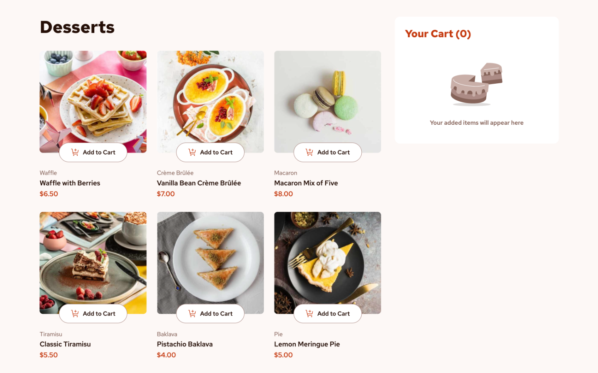

# Product List with Cart

A responsive product ordering interface built as a solution to the Frontend Mentor Product List with Cart UI challenge.

Users can browse available products, add items to a cart, adjust quantities, remove items, review their order, and confirm purchases through an interactive confirmation modal.

---

## Table of Contents

- [Overview](#overview)
  - [The Challenge](#the-challenge)
  - [Screenshot](#screenshot)
  - [Links](#links)
- [My Process](#my-process)
  - [Built with](#built-with)
  - [Technical Highlights](#technical-highlights)
  - [What I Learned](#what-i-learned)
  - [Continued Development](#continued-development)
  - [Useful Resources](#useful-resources)
  - [AI Collaboration](#ai-collaboration)
- [Author](#author)

---

# Overview

## The Challenge

The goal of this project was to build a responsive product ordering interface that allows users to:

- View a collection of products
- Load product information from external JSON data
- Add products to a shopping cart
- Increase and decrease item quantities
- Remove items from the cart
- View updated cart totals dynamically
- Review their order before confirmation
- Confirm an order through a modal window
- Start a new order and reset the application state
- Experience a responsive layout across desktop, tablet, and mobile devices

The challenge focused on creating an interactive shopping cart experience while maintaining clean UI behavior, responsive design, and accessible controls.

## Screenshot

## Links

- Solution URL: [GitHub Repository](https://github.com/dlewisSTL/Product-List-with-Cart)
- Live Site URL: [Live Demo](https://product-list-with-cart-steel.vercel.app)

---

# My Process

## Built with

- Semantic HTML5 markup
- CSS custom properties
- CSS Flexbox
- CSS Grid
- Responsive design
- Mobile-first development
- Vanilla JavaScript
- DOM manipulation
- Fetch API
- JSON data handling
- CSS animations and transitions
- Accessible button controls

## Technical Highlights

- Built a dynamic product list using data loaded from a JSON file
- Generated product cards dynamically using JavaScript
- Implemented shopping cart functionality using application state
- Added product quantity controls for increasing and decreasing items
- Added multiple methods for removing products from the cart
    - Quantity decrement button
    - Cart removal button
- Dynamically updated cart quantity totals
- Dynamically calculated order totals
- Created an order confirmation modal
- Displayed purchased items inside the confirmation modal
- Implemented a "Start New Order" reset flow
- Added responsive product layouts for desktop, tablet, and mobile screens
- Used semantic buttons and accessible labels for interactive controls
- Implemented responsive product imagery using the <picture> element with mobile, tablet, and desktop sources
- Organized application state separately from UI update functions

---

## What I Learned

This project strengthened my understanding of building interactive frontend applications with vanilla JavaScript while focusing on application state, DOM updates, and responsive UI behavior.

Some of the main concepts I practiced:

### Application State Management

I created and managed application state for:

- Product data
- Current cart contents
- Product quantities
- Order totals

Keeping the application state separate from the UI helped make the code easier to reason about and maintain.

### Dynamic Rendering

I practiced generating UI elements from application data instead of manually creating every product card.

This included:

- Loading product information from JSON
- Creating product cards dynamically
- Updating product quantity controls
- Rendering cart items
- Rendering confirmation modal content

### Cart State Synchronization

A major focus of this project was keeping multiple areas of the interface synchronized.

This included:

- Updating product cards when quantities change
- Updating the cart count
- Updating cart totals
- Removing items from both the cart and product interface
- Resetting the interface after completing an order

### DOM Manipulation

I used JavaScript DOM methods to create and update interface elements.

This included:

- Creating HTML elements dynamically
- Updating classes based on application state
- Handling user interactions through event listeners
- Managing modal visibility
- Updating displayed quantities and prices

### Event Delegation

I used event delegation for dynamically generated content.

This allowed product cards and cart items to respond to user interactions without attaching individual event listeners to every button.

Examples:

- Add to cart buttons
- Quantity increase buttons
- Quantity decrease buttons
- Remove buttons
- Confirmation buttons

### Modal and Accessibility

I implemented an order confirmation modal while practicing accessible interaction patterns.

The modal includes:

- Dynamic order summary rendering
- ARIA visibility updates
- Escape-key support
- Clear confirmation actions
- Keyboard-accessible buttons

### Responsive Design

I used responsive CSS techniques to create layouts that adapt across:

- Desktop
- Tablet
- Mobile

The project required careful attention to:

- Product card layouts
- Cart positioning
- Modal sizing
- Mobile spacing
- Responsive images

---

## Continued development

Future improvements I would like to explore:

- Improve modal focus management
- Add focus restoration when closing the modal
- Add more advanced keyboard navigation
- Store cart data using Local Storage
- Add product filtering and search functionality
- Improve animation transitions
- Rebuild the application using React and TypeScript to compare architecture approaches
- Explore connecting the application to a backend shopping API

---

## Useful resources

- [Frontend Mentor](https://www.frontendmentor.io/) - Provided the design challenge and project requirements.

- [MDN Web Docs](https://developer.mozilla.org/) - Used as a reference for JavaScript, DOM APIs, Fetch, and browser functionality.

- [JavaScript.info](https://javascript.info/) - Helpful reference for JavaScript concepts and patterns.

---

## AI Collaboration

I used ChatGPT as an AI development assistant throughout this project.

AI was used for:

- Reviewing JavaScript structure
- Debugging application behavior
- Discussing code organization
- Reviewing accessibility improvements
- Troubleshooting UI issues
- Discussing state management approaches
- Reviewing responsive design decisions
- Preparing the project for final polish and deployment

The development process remained hands-on, with AI acting as a collaboration and problem-solving tool rather than replacing implementation.

---

# Author

- Website - [Derek Lewis](https://derek-lewis.com/)
- Frontend Mentor - [@dlewisSTL](https://www.frontendmentor.io/profile/dlewisSTL)

